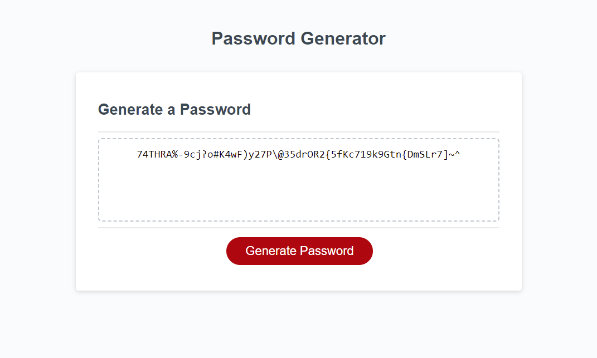

# Password Generator

## Description
This is a password generation tool that offers some useful customisation options. Users can specify how long they desire their generated password to be with meaningful feedback when values provided are errenous or not within the stipulated 8-128 characters. Users can also specify what types of characters they wish to include of: lowercase, uppercase, numeric and special. Meaningful feedback is provided along the way and at least one category must be selected in order for the user to progress to the password generation stage.



## Installation

Please clone this repository with the following command in your terminal:

```
git clone https://github.com/jamesaps/password-generator.git
```

## Usage
This site is designed to automatically deploy to github pages when changes are committed to the main branch. You can find a link to a live version of the site [here](https://jamesaps.github.io/password-generator/).

## Credits
Array shuffle algorithm provided by:
* [Fisher-Yates Shuffle](https://stackoverflow.com/a/2450976)

## License

Licensed under the [MIT](https://github.com/jamesaps/password-generator/blob/main/LICENSE) license.

© 2024 James Stott. Confidential and Proprietary. All Rights Reserved.